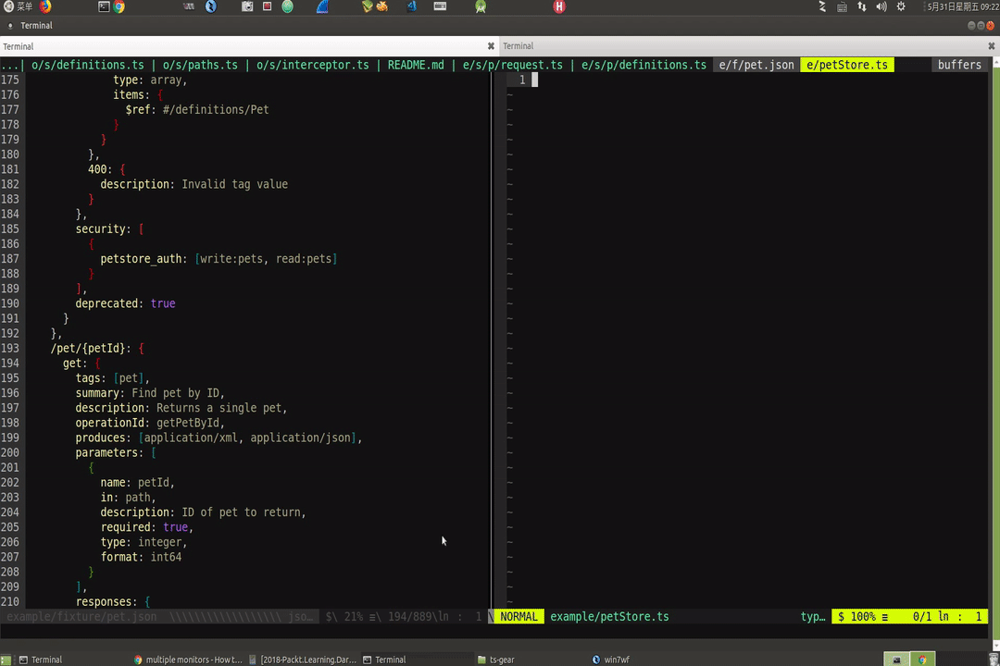

# ts-gear

## [English doc](./README.en.md)

## 用途

自动从swagger生成ts类型与请求接口的函数

方便的感知后端接口定义的变化。

## 起源

inspired by [pont](https://github.com/alibaba/pont)

`ts-gear`命名：ts是typescript与swagger的组合，gear寓意通过这个工具像齿轮一样，将前后端紧密的结合在一起，构成一架严密运转的机器。

后来想想，其实应该是与openapi结合而不仅限与swagger，不过名字起了挺久那就这样吧不改了。

## 用法

### 安装

```bash
yarn add ts-gear -D
// or
npm install ts-gear -D
```

### 生成初始化配置

在项目`src`目录下生成配置文件`tsg.config.ts`。

```bash
tsg -i
```

💡 因为该配置文件与请求函数有关，会在生成的代码调用，因此放到`src`文件夹中。

### 运行tsg

```bash
npx tsg // default use `src/tsg.config.ts`
// or assign another config file
npx tsg -c other_dir/tsg.config.ts
// or if only need update one project, use -p for the project name
npx tsg -p pet
```

#### 查看`src/service`文件夹，结构如下

```bash
▾ src/
  tsg.config.ts
  ▾ service/
    ▾ pet/
        definition.ts
        request.ts
        index.ts
```

[more directory information](#目录结构)

#### 如何在代码中调用

例如：在`src/store/pet.ts`文件中

```javascript
import { getPetPetId } from '../../service/pet'

getPetPetId({
  path: {
    petId: 1
  }
}).then(pet => {
  console.log(pet)
  // pet will be the instance of Pet, it has Pet properties.
})
```



### V4不兼容更新

* 默认请求函数的参数与返回值类型不在导出，推荐使用类型工具`Parameters`与`ReturnType`来从请求函数类型本身获取。

    如果需要导出参数与返回值类型，可配置项目中的

    ```javascript
    shouldExportRequestOptionType: true
    shouldExportResponseType: true
    ```

* 默认不生成mock数据，需要的话可配置`shouldGenerateMock: true`，生成独立的mockRequest文件。

### 新配置项

* generateRequestFunctionName

例如：

```javascript
generateRequestFunctionName: ({
  httpMethod: 'get' | 'put' | 'post' | 'delete' | 'options' | 'head' | 'patch'
  pathname: string
  schema: Path // openapi类型定义中的Path，内容太多不详细说了
}): string => {
  return `${httpMethod}${upperFirst(pathname.repalce('/api/commonPath', ''))}`
}
```

* shouldGenerateMock，是否生成mock数据，默认为false，不生成。

* generateRequestFunction，生成请求函数体，用这个的话，函数内容ts-gear就不再管了，完全由这个自定义函数生成，慎重使用🙏。

## 测试覆盖约50%，大概🤪，覆盖率统计比实际测试的显示的多。

### Statements


### Branches


### Functions


### Lines


### 运行步骤

* 读取配置文件。

* 读取命令行参数过滤需要解析的项目。

* 获取各个项目的openapi数据。

* 如果设置了翻译，调用翻印接口。

* 统一格式化所有特殊字符。

* 解析范型名称。

* 将所有请求与定义名称组装到内部的全局变量中。

* 配置当前输出换行符。

* 准备好输出文件夹。

* 写入枚举与基础类型定义。

* 写入请求函数。

* 生成一个导出所有内容的索引文件`index.ts`。

## 其他类似工具

* [OpenAPI Generator](https://openapi-generator.tech/)

* [swagger-codegen](https://swagger.io/tools/swagger-codegen/)

* [oazapfts](https://github.com/cellular/oazapfts)

### 本项目的特色

大多数其他类型的openapi生成工具对原始定义的要求较高，容错率低，而且没有做生成范型的处理。而这几项目都是本工具的重点解决亮点。

支持 OpenAPI Specification v2 v3.

### 配置样例

`tsg.config.ts` example

```typescript
import type { Project } from 'ts-gear'

const projects: Project[] = [
  { ... }
]

export default projects
```

#### 配置项说明

##### 注意：以下所有配置的相对路径，都是`tsg.config.ts`文件所在的路径。例如该文件位置为`src/tsg.config.ts`，则配置中的路径都是相对`src`路径而定。

| Option name | type | required | default | description                                                                                                                  |
|--------|------|---------|----------|------------------------------------------------------------------------------------------------------------------------------|
| name | string | true | | 项目名称，需符合合法变量名称                                                                                                               |
| dest | string | true | | 输出文件夹，默认在以`src`中，比如配置为`service`，则实际目录为`src/service`                                                                          |
| source | string | true | | openapi文档的json定义url <br /> 可以是远程(例如：`http://1.1.1.1/v2/api-docs`)或本地(例如`src/service/api.json`)，如果远程访问有登录或其他网络问题，推荐将定义文档下载到本地 |
| fetchApiDocOption | [RequestInit](https://developer.mozilla.org/en-US/docs/Web/API/WindowOrWorkerGlobalScope/fetch#Parameters) | false | | 配合上个配置项`source`，当远程访问`source`有登录或其他校验需求时，配置该项填写校验信息，该项是原生`fetch`的第二个配置参数。                                                    |
| apiFilter | RegExp \| (({pathname: string, httpMethod: HttpMethod}) => boolean) | false |                                                                                                                              | 生成请求函数的过滤器，一个大的api定义文档中可能大多数都用不到，使用正则或函数可仅生成自己项目需要的api函数，减轻编译负担 |
| importRequesterStatement | string | true | | 例如:`import axios from "axios"`或`import { request } from '../your/request'`，默认导入或命名导入都可以，如果是命名导入有多个则会使用第一个作为请求函数              |
| preferClass | boolean | false | false | 会使用class而不是interface生成接口中定义的数据类型（请求参数与返回值类型不会生成）                                                                             |
| withHost | boolean | false | false | 为true时，每个请求函数请求的api url不再是`/api/url`这种路径格式，而是`http://1.1.1.1/api/url`这种完整的格式，当需要生成跨域请求时可以配置为true                             |
| withBasePath | boolean | false | false | 为true时，每个请求url的路径前面都会加上openapi定义中的`basePath`项，按需配置                                                                           |
| keepGeneric | boolean | true | true | 尝试生成范型类型，虽然做了各种努力但肯定还有一些情况不能生成范型，如果运行失败可将该项设置为false                                                                          |
| translationEngine | 'baidu' \| 'google' | false |                                                                                                                              | 如果文档中确实有一些类型的东西用中文定义的，可配置翻译引擎尝试翻译 |
| shouldGenerateMock | boolean | true | 默认true，生成mock数据，如果您的项目不需要mock数据，或有自己的mock策略，可配置为false，减少生成的代码量 |
| shouldExportRequestOptionType | boolean | false | 默认false，不导出 |
| shouldExportResponseType | boolean | false | 默认false，不导出 |
| prettierConfig | [Options](https://prettier.io/docs/en/options.html) | false | | 生成文件的`prettier`配置，参考`prettier`官网                                                                                             |
| generateRequestFunctionName | (arg: GenerateRequestFunctionNameParameter) => string | false | 生成请求函数名称的函数 |
| generateRequestFunction | (arg: GenerateRequestFunctionNameParameter) => string | false | 生成请求函数体的函数 |
| transformJS | boolean | false | false | 是否生成`js`而不是`ts`文件                                                                                                            |
| useCache | boolean | false | false | 是否生成缓存，为true时会在之后优先使用缓存而不是请求实际的openapi文档，缓存位置为`node_modules/.cache`，参照babel等工具的cache也放在这里。                                   |
| EOL | string | false  | '\n' | 是否生成缓存，为true时会在之后优先使用缓存而不是请求实际的openapi文档，缓存位置为`node_modules/.cache`，参照babel等工具的cache也放在这里。                                   |
| nullableFalseAsRequired | boolean | false | false | 是否使用nullable来作为生成`?`的规则                                                                                                      |
| simplifyRequestOption | boolean | false | false | 是否使用简化模式的请求参数，去掉query 或 body 的层级 |
| stripBodyPropWhenOnlyOneBodyProp | boolean | false | false | 当请求的body内只有一个参数时，且该参数是一个schema，则去掉这层参数 |
| requestOptionUnionType | string | false | undefined | 为请求参数的类型添加一个联合类型，具体参阅源码中的`src/type`, 使用该选项将使`simplifyRequestOption`失效 |
### axios

`ts-gear`内置的`axiosRequester`接受一个`axios`的实例作为参数，如果没有则使用默认的`axios`。

对于`axios`的各种配置可自己首先创建一个`axios`实例，然后传入`axiosRequester`使用。

### 目录结构

* `definition.ts`由`definitions`部分生成，包含所有基础类型定义。

* `request.ts`由`paths`生成，请求函数的命名规则：`http request + api path`，例如:

```javascript
  "paths": {
    "/pet": {
      "post": { // 生成 `postPet`
      ...
      },
    },
    "/pet/findByTags": {
      "get": { // 生成 'getPetFindByTags'
      ...
      },
    },
    "/pet/{petId}": {
      "get": { // 生成 'getPetPetId' function
      ...
      },
    },
```

* `index.ts`是`definition.ts`与`request.ts`的导出出口文件。

每个请求函数的入参与返回数据类型，都会生成确定的ts类型。

如果生成的请求函数不能满足需求，也可以只使用`definition.ts`中的数据类型定义。
